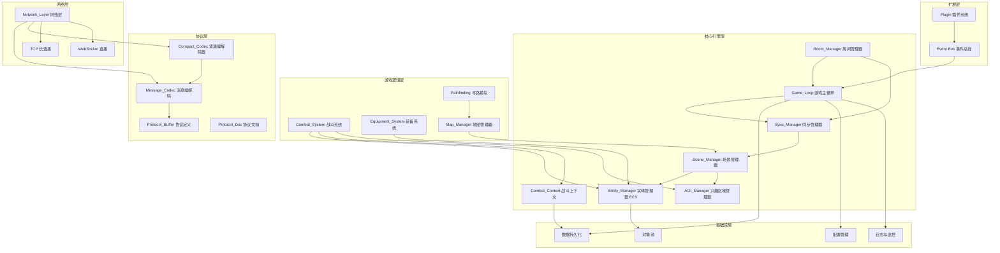
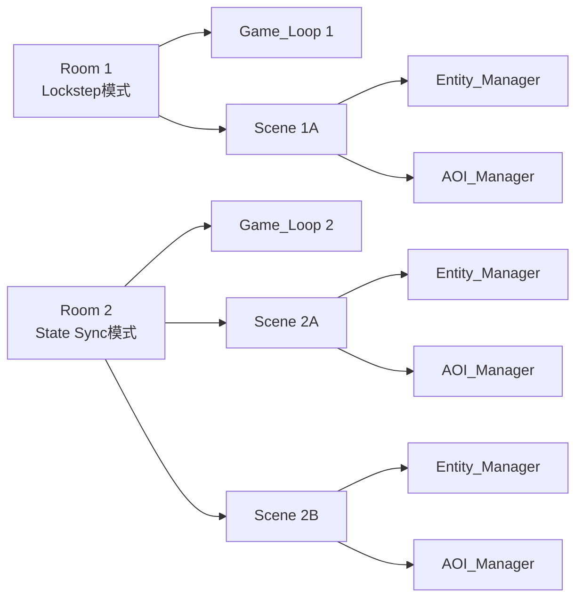
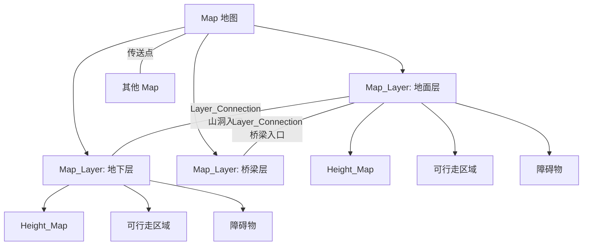
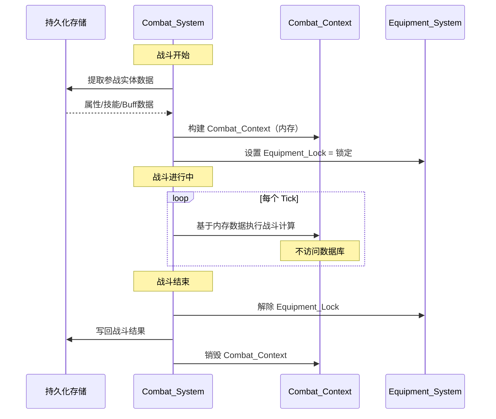

# 技术设计文档：MMRPG 游戏引擎 (gfgame)

## 概述

gfgame 是基于 GoFrame 框架构建的 MMRPG 纯游戏后端引擎，核心卖点为千人同屏战斗。引擎采用 ECS（Entity-Component-System）架构，支持帧同步（Lockstep）与状态同步（State Sync）双模式，提供层次化地图系统、装备系统、战斗系统等核心模块。

引擎作为纯后端服务，不包含任何前端逻辑。前端（如 html5-mmrpg-game）通过 WebSocket/TCP 协议与引擎通信，完全解耦。

### 设计目标

- 支持单 Scene 1000+ 活跃实体的千人同屏战斗
- 帧同步与状态同步双模式，按 Room 粒度灵活切换
- ECS 架构实现数据驱动、高性能的游戏逻辑
- 层次化地图系统支持多层地形、遮挡计算、跨层寻路
- 战斗期间装备锁定 + 数据内存化，保证性能和公平性
- 插件化扩展机制，不修改核心代码即可扩展功能
- 完善的协议文档和 Client SDK，方便多端接入

### 技术栈

- 语言：Go 1.21+
- 框架：GoFrame v2
- 网络：GoFrame gnet/gtcp（TCP）+ gorilla/websocket（WebSocket）
- 序列化：Protocol Buffers（protobuf）+ JSON
- 数据库：GoFrame ORM（MySQL/PostgreSQL）
- 配置：GoFrame gcfg（YAML/JSON/TOML）
- 日志：GoFrame glog

## 架构

### 整体架构

引擎采用分层架构，自底向上分为网络层、协议层、核心引擎层、游戏逻辑层和扩展层。




### Room 与 Scene 的关系



每个 Room 拥有独立的 Game_Loop 和同步模块，可包含一个或多个 Scene。每个 Scene 维护独立的 Entity_Manager 和 AOI_Manager 实例。

### 地图层次结构



### 战斗数据流



## 组件与接口

### 1. Network_Layer（网络层）

```go
// Session 统一会话抽象，屏蔽 TCP/WebSocket 差异
type Session interface {
    ID() string
    Send(msg []byte) error
    Close() error
    RemoteAddr() string
    Protocol() TransportProtocol // TCP or WebSocket
}

// TransportProtocol 传输协议类型
type TransportProtocol int
const (
    ProtocolTCP       TransportProtocol = iota
    ProtocolWebSocket
)

// NetworkLayer 网络层接口
type NetworkLayer interface {
    Start() error
    Stop() error
    // 注册连接/断连/消息回调
    OnConnect(handler func(session Session))
    OnDisconnect(handler func(session Session))
    OnMessage(handler func(session Session, data []byte))
    // 获取当前连接数
    ConnectionCount() int
}

// NetworkConfig 网络配置
type NetworkConfig struct {
    TCPAddr           string        // TCP 监听地址
    WSAddr            string        // WebSocket 监听地址
    WSSEnabled        bool          // 是否启用 WSS
    TLSCertFile       string        // TLS 证书
    TLSKeyFile        string        // TLS 密钥
    HeartbeatInterval time.Duration // 心跳间隔
    HeartbeatTimeout  time.Duration // 心跳超时
    MaxConnections    int           // 最大连接数（默认 5000）
}
```

### 2. Message_Codec（消息编解码器）

```go
// MessageCodec 消息编解码接口
type MessageCodec interface {
    Encode(msg Message) ([]byte, error)
    Decode(data []byte) (Message, error)
    Format(msg Message) string // 可读文本格式化（调试用）
}

// Message 消息结构
type Message struct {
    ID   uint16 // 消息 ID
    Body proto.Message // protobuf 消息体
}

// PacketFormat: [4字节消息长度][2字节消息ID][消息体]
// CodecType 编解码类型
type CodecType int
const (
    CodecProtobuf CodecType = iota
    CodecJSON
)
```

### 2.1 Compact_Codec（紧凑编解码器）

```go
// OperationCode 操作码类型
type OperationCode byte

// 预定义操作码
const (
    OpMoveUp    OperationCode = 'u' // 向上移动
    OpMoveDown  OperationCode = 'd' // 向下移动
    OpMoveLeft  OperationCode = 'l' // 向左移动
    OpMoveRight OperationCode = 'r' // 向右移动
    OpAttack    OperationCode = 'a' // 攻击
    OpSkill     OperationCode = 's' // 释放技能
    OpInteract  OperationCode = 'i' // 交互
    OpChat      OperationCode = 'c' // 聊天
)

// CompactOperation 紧凑操作
type CompactOperation struct {
    SourceShortID string        // 操作发起者短 ID
    OpCode        OperationCode // 操作码
    Params        []string      // 操作参数（如移动距离、目标短 ID、技能 ID 等）
}

// CompactMessage 紧凑消息（一个 Tick 内同一实体的多个操作合并）
type CompactMessage struct {
    Operations []CompactOperation
    RawData    string // 原始编码字符串，如 "Au10aB"
}

// ShortIDMapper 短 ID 映射器接口
type ShortIDMapper interface {
    // 为实体分配短 ID
    Assign(entityID EntityID) (string, error)
    // 通过短 ID 查找实体 ID
    Resolve(shortID string) (EntityID, bool)
    // 释放短 ID
    Release(entityID EntityID)
    // 获取实体的短 ID
    GetShortID(entityID EntityID) (string, bool)
}

// OperationDictionary 操作码字典接口
type OperationDictionary interface {
    // 注册操作码
    Register(code OperationCode, opType string)
    // 通过操作码获取操作类型
    GetOpType(code OperationCode) (string, bool)
    // 通过操作类型获取操作码
    GetOpCode(opType string) (OperationCode, bool)
    // 获取所有已注册的操作码
    AllCodes() map[OperationCode]string
}

// CompactCodec 紧凑编解码器接口
type CompactCodec interface {
    // 将操作序列编码为紧凑字符串
    Encode(ops []CompactOperation) (string, error)
    // 将紧凑字符串解码为操作序列
    Decode(data string) ([]CompactOperation, error)
    // 将同一 Tick 内同一实体的多个操作合并编码
    EncodeBatch(entityShortID string, ops []CompactOperation) (string, error)
    // 格式化输出：将紧凑消息解码为可读文本（调试用）
    Format(data string) (string, error)
    // 获取短 ID 映射器
    ShortIDMapper() ShortIDMapper
    // 获取操作码字典
    Dictionary() OperationDictionary
}

// CompactCodecConfig 紧凑编解码器配置
type CompactCodecConfig struct {
    MaxShortIDLength int  // 短 ID 最大长度（默认 2 字符）
    EnableBatch      bool // 是否启用批量操作合并（默认 true）
}
```

### 3. Game_Loop（游戏主循环）

```go
// GameLoop 游戏主循环接口
type GameLoop interface {
    Start() error
    Stop() error
    CurrentTick() uint64
    TickRate() int // Tick/秒
    // 注册 Tick 阶段回调
    RegisterPhase(phase TickPhase, handler TickHandler)
}

// TickPhase Tick 执行阶段
type TickPhase int
const (
    PhaseInput   TickPhase = iota // 输入处理
    PhaseUpdate                    // 逻辑更新
    PhaseSync                      // 状态同步
    PhaseCleanup                   // 清理
)

type TickHandler func(tick uint64, dt time.Duration)

// GameLoopConfig 主循环配置
type GameLoopConfig struct {
    TickRate int // 默认 20
}
```

### 4. Sync_Manager（同步管理器）

```go
// SyncMode 同步模式
type SyncMode int
const (
    SyncModeLockstep SyncMode = iota
    SyncModeState
)

// Syncer 同步器统一接口
type Syncer interface {
    Mode() SyncMode
    OnInput(session Session, input PlayerInput)
    OnTick(tick uint64)
    OnReconnect(session Session)
}

// LockstepSyncer 帧同步器
type LockstepSyncer interface {
    Syncer
    HistoryFrames() int // 历史帧缓存数量
}

// StateSyncer 状态同步器
type StateSyncer interface {
    Syncer
    SnapshotInterval() int // 快照间隔帧数
}

// SyncManagerConfig 同步管理器配置
type SyncManagerConfig struct {
    DefaultMode          SyncMode
    LockstepTimeout      time.Duration // 帧同步等待超时（默认 100ms）
    HistoryFrames        int           // 历史帧缓存（默认 300）
    SnapshotInterval     int           // 状态快照间隔（默认 100 帧）
    AutoSwitchThreshold  int           // 自动切换建议阈值（默认 50 人）
}
```

### 5. Entity_Manager（ECS 实体管理器）

```go
// EntityID 实体唯一标识
type EntityID uint64

// Component 组件接口
type Component interface {
    Type() ComponentType
}

// ComponentType 组件类型标识
type ComponentType uint16

// System ECS 系统接口
type System interface {
    Name() string
    Priority() int
    RequiredComponents() []ComponentType
    Update(tick uint64, entities []EntityID, world *World)
}

// World ECS 世界（每个 Scene 一个）
type World struct {
    entities   map[EntityID]map[ComponentType]Component
    systems    []System
}

// EntityManager 实体管理器接口
type EntityManager interface {
    CreateEntity() EntityID
    DestroyEntity(id EntityID)
    AddComponent(id EntityID, comp Component)
    RemoveComponent(id EntityID, compType ComponentType)
    GetComponent(id EntityID, compType ComponentType) (Component, bool)
    Query(compTypes ...ComponentType) []EntityID
    RegisterSystem(sys System)
    Update(tick uint64)
}
```


### 6. Scene_Manager（场景管理器）

```go
// Scene 场景实例
type Scene struct {
    ID            string
    World         *World          // ECS 世界
    AOI           AOIManager      // AOI 管理器
    MapData       *Map            // 关联的地图数据
    LastActiveAt  time.Time       // 最后活跃时间
    BoundaryZones []*SceneBoundaryZone // 与相邻 Scene 的边界区域
}

// SceneBoundaryZone 场景边界区域
type SceneBoundaryZone struct {
    NeighborSceneID string   // 相邻场景 ID
    LocalMin        Vector3  // 本场景边界区域最小坐标
    LocalMax        Vector3  // 本场景边界区域最大坐标
    RemoteMin       Vector3  // 相邻场景边界区域最小坐标
    RemoteMax       Vector3  // 相邻场景边界区域最大坐标
    PreloadDistance  float32 // 触发预加载的距离阈值
}

// SceneManager 场景管理器接口
type SceneManager interface {
    CreateScene(config SceneConfig) (*Scene, error)
    GetScene(id string) (*Scene, bool)
    UnloadScene(id string) error
    EnterScene(entityID EntityID, sceneID string) error
    TransferScene(entityID EntityID, fromSceneID, toSceneID string) error
    ActiveSceneCount() int
    // 无缝转场相关
    ConfigureBoundaryZone(sceneID, neighborSceneID string, zone *SceneBoundaryZone) error
    GetBoundaryZone(sceneID, neighborSceneID string) (*SceneBoundaryZone, bool)
    // 检查实体是否在边界区域内
    IsInBoundaryZone(entityID EntityID, sceneID string) (bool, string) // 返回是否在边界区域及相邻场景 ID
    // 触发边界预加载，将相邻 Scene 的边界区域数据推送给 Client
    TriggerBoundaryPreload(entityID EntityID, sceneID, neighborSceneID string) error
    // 无缝切换：实体从边界区域完全进入目标 Scene，不中断操作
    SeamlessTransfer(entityID EntityID, fromSceneID, toSceneID string) error
}

// SceneConfig 场景配置
type SceneConfig struct {
    ID              string
    MapID           string
    MaxEntities     int
    IdleTimeout     time.Duration // 空闲超时（默认 5 分钟）
    AdmissionCheck  func(EntityID) bool
    BoundaryZones   []*SceneBoundaryZone // 边界区域配置
}
```

### 7. AOI_Manager（兴趣区域管理器）

```go
// AOIManager 兴趣区域管理器接口
type AOIManager interface {
    Add(entityID EntityID, pos Vector3, aoiRadius float32)
    Remove(entityID EntityID)
    UpdatePosition(entityID EntityID, newPos Vector3)
    GetVisibleEntities(entityID EntityID) []EntityID
    SetAOIRadius(entityID EntityID, radius float32)
    // 事件回调
    OnEnterView(handler func(watcher, target EntityID))
    OnLeaveView(handler func(watcher, target EntityID))
    // 跨边界 AOI 支持
    // 注册相邻 AOI_Manager，用于 Cross_Boundary_AOI 计算
    RegisterNeighborAOI(neighborID string, neighbor AOIManager, boundaryZone *AOIBoundaryZone)
    UnregisterNeighborAOI(neighborID string)
    // 获取跨边界可见实体（包含本地和相邻 AOI_Manager 中的可见实体）
    GetCrossBoundaryVisibleEntities(entityID EntityID) []CrossBoundaryEntity
    // 将本地边界区域内的实体列表暴露给相邻 AOI_Manager 查询
    GetBoundaryEntities(neighborID string) []EntityID
}

// AOIBoundaryZone AOI 边界区域定义
type AOIBoundaryZone struct {
    LocalMin  Vector3 // 本地边界区域最小坐标
    LocalMax  Vector3 // 本地边界区域最大坐标
    RemoteMin Vector3 // 远端边界区域最小坐标
    RemoteMax Vector3 // 远端边界区域最大坐标
}

// CrossBoundaryEntity 跨边界实体信息
type CrossBoundaryEntity struct {
    EntityID  EntityID
    SourceID  string  // 来源 AOI_Manager 标识（本地为空，跨边界为 neighborID）
    Position  Vector3
}

// Vector3 三维坐标
type Vector3 struct {
    X, Y, Z float32
}

// SpatialIndex 空间索引接口
type SpatialIndex interface {
    Insert(entityID EntityID, pos Vector3)
    Remove(entityID EntityID)
    Update(entityID EntityID, newPos Vector3)
    QueryRange(center Vector3, radius float32) []EntityID
}
```

### 8. Combat_System（战斗系统）

```go
// CombatSystem 战斗系统接口
type CombatSystem interface {
    StartCombat(participants []EntityID) (*CombatContext, error)
    EndCombat(ctx *CombatContext) error
    CastSkill(caster EntityID, skillID uint32, targets []EntityID) error
    ApplyBuff(target EntityID, buffID uint32, source EntityID) error
    RemoveBuff(target EntityID, buffID uint32)
}

// CombatContext 战斗上下文（内存中）
type CombatContext struct {
    ID            string
    Participants  map[EntityID]*CombatEntity
    StartTick     uint64
    Active        bool
}

// CombatEntity 参战实体的战斗数据快照
type CombatEntity struct {
    EntityID    EntityID
    Attributes  map[string]float64  // 战斗属性
    Skills      []SkillData
    Buffs       []*BuffInstance
    EquipLocked bool                // 装备锁定状态
}

// SkillPhase 技能阶段
type SkillPhase int
const (
    SkillPhaseWindup   SkillPhase = iota // 前摇
    SkillPhaseHit                         // 判定
    SkillPhaseSettle                      // 结算
    SkillPhaseRecovery                    // 后摇
)

// SkillConfig 技能配置
type SkillConfig struct {
    ID              uint32
    CastCondition   func(*CombatEntity) bool
    TargetMode      TargetMode      // 单体/扇形/圆形/矩形
    DamageFormula   string          // 伤害公式表达式
    Phases          []SkillPhaseConfig
    InterruptPolicy InterruptPolicy // 中断策略
}

// TargetMode 目标选取模式
type TargetMode int
const (
    TargetSingle    TargetMode = iota
    TargetFan
    TargetCircle
    TargetRectangle
)

// InterruptPolicy 技能中断策略
type InterruptPolicy int
const (
    InterruptCancel   InterruptPolicy = iota // 取消后续阶段
    InterruptContinue                         // 继续执行
)

// CombatLogEvent 战斗日志事件
type CombatLogEvent struct {
    Tick      uint64
    Attacker  EntityID
    Target    EntityID
    SkillID   uint32
    Damage    float64
    IsCrit    bool
    Timestamp time.Time
}
```

### 9. Equipment_System（装备系统）

```go
// EquipmentSystem 装备系统接口
type EquipmentSystem interface {
    Equip(entityID EntityID, slot EquipmentSlotType, item *EquipmentItem) error
    Unequip(entityID EntityID, slot EquipmentSlotType) (*EquipmentItem, error)
    GetEquipped(entityID EntityID, slot EquipmentSlotType) (*EquipmentItem, bool)
    GetAllEquipped(entityID EntityID) map[EquipmentSlotType]*EquipmentItem
    CalculateAttributes(entityID EntityID) map[string]float64
    SetLock(entityID EntityID, locked bool)
    IsLocked(entityID EntityID) bool
}

// EquipmentSlotType 装备槽位类型
type EquipmentSlotType int
const (
    SlotWeapon  EquipmentSlotType = iota
    SlotHelmet
    SlotArmor
    SlotBoots
    SlotNecklace
    SlotRing
)

// EquipmentItem 装备物品
type EquipmentItem struct {
    ID         uint64
    Name       string
    SlotType   EquipmentSlotType
    Quality    EquipmentQuality
    Level      int
    Attributes map[string]float64 // 附加属性
}

// EquipmentQuality 装备品质
type EquipmentQuality int
const (
    QualityNormal    EquipmentQuality = iota
    QualityRare
    QualityEpic
    QualityLegendary
)
```

### 10. Map_Manager（地图管理器）

```go
// Map 地图
type Map struct {
    ID           string
    Layers       []*MapLayer
    Teleports    []TeleportPoint    // 跨 Map 传送点
    Boundaries   []*MapBoundaryZone // 与相邻 Map 的边界区域
}

// MapBoundaryZone 地图边界区域
type MapBoundaryZone struct {
    NeighborMapID  string  // 相邻地图 ID
    LocalMin       Vector3 // 本地图边界区域最小坐标
    LocalMax       Vector3 // 本地图边界区域最大坐标
    RemoteMin      Vector3 // 相邻地图边界区域最小坐标
    RemoteMax      Vector3 // 相邻地图边界区域最大坐标
    PreloadDistance float32 // 触发预加载的距离阈值
}

// MapLayer 地图层
type MapLayer struct {
    ID           string
    LayerIndex   int
    HeightMap    [][]float32     // 高度图
    Walkable     [][]bool        // 可行走区域
    Obstacles    []Obstacle
    Connections  []LayerConnection
}

// LayerConnection 层连接点
type LayerConnection struct {
    ID            string
    SourceLayer   int
    SourcePos     Vector3
    TargetLayer   int
    TargetPos     Vector3
    ConnectionType string // 山洞入口/楼梯/传送门
    PreloadDistance float32 // 触发目标层预加载的距离阈值
}

// TeleportPoint 跨 Map 传送点
type TeleportPoint struct {
    ID        string
    Position  Vector3
    TargetMap string
    TargetPos Vector3
}

// MapManager 地图管理器接口
type MapManager interface {
    LoadMap(mapID string) (*Map, error)
    UnloadMap(mapID string) error
    GetMap(mapID string) (*Map, bool)
    Teleport(entityID EntityID, fromMapID, toMapID string, targetPos Vector3) error
    SwitchLayer(entityID EntityID, mapID string, connectionID string) error
    HotReload(mapID string) error
    // 无缝地图对接相关
    // 配置相邻 Map 之间的边界区域
    ConfigureMapBoundary(mapID, neighborMapID string, zone *MapBoundaryZone) error
    GetMapBoundary(mapID, neighborMapID string) (*MapBoundaryZone, bool)
    // 检查实体是否接近地图边界，返回是否需要预加载及相邻地图 ID
    CheckBoundaryProximity(entityID EntityID, mapID string) (needPreload bool, neighborMapID string)
    // 触发边界预加载，将相邻 Map 的边界区域地形和实体数据推送给 Client
    TriggerMapBoundaryPreload(entityID EntityID, mapID, neighborMapID string) error
    // 无缝地图切换：实体从边界区域完全进入相邻 Map，不中断操作
    SeamlessMapTransfer(entityID EntityID, fromMapID, toMapID string) error
    // 无缝层切换：实体通过 Layer_Connection 切换层，不需要加载画面
    SeamlessLayerSwitch(entityID EntityID, mapID string, connectionID string) error
    // 触发层切换预加载，将目标 Map_Layer 的地形和实体数据推送给 Client
    TriggerLayerPreload(entityID EntityID, mapID string, connectionID string) error
}

// Pathfinder 寻路接口
type Pathfinder interface {
    FindPath(mapData *Map, start, end Vector3, startLayer, endLayer int) ([]Vector3, error)
}
```

### 11. Room_Manager（房间管理器）

```go
// Room 游戏房间
type Room struct {
    ID            string
    GameLoop      GameLoop
    Syncer        Syncer
    Scenes        map[string]*Scene
    Clients       map[string]Session
    MaxCapacity   int
    CreatedAt     time.Time
    BoundaryZones []*RoomBoundaryZone // 与相邻 Room 的边界区域
}

// RoomBoundaryZone 房间边界区域
type RoomBoundaryZone struct {
    NeighborRoomID string  // 相邻房间 ID
    LocalMin       Vector3 // 本房间边界区域最小坐标
    LocalMax       Vector3 // 本房间边界区域最大坐标
    RemoteMin      Vector3 // 相邻房间边界区域最小坐标
    RemoteMax      Vector3 // 相邻房间边界区域最大坐标
}

// EntityMigrationState 实体迁移状态
type EntityMigrationState struct {
    EntityID      EntityID
    SourceRoomID  string
    TargetRoomID  string
    State         MigrationPhase
    EntityData    map[ComponentType]Component // 迁移中的实体数据快照
    StartTime     time.Time
}

// MigrationPhase 迁移阶段
type MigrationPhase int
const (
    MigrationPrepare   MigrationPhase = iota // 准备阶段：快照实体数据
    MigrationTransfer                         // 传输阶段：在目标 Room 创建实体
    MigrationConfirm                          // 确认阶段：目标 Room 确认接收
    MigrationCleanup                          // 清理阶段：从源 Room 移除实体
    MigrationComplete                         // 完成
)

// RoomManager 房间管理器接口
type RoomManager interface {
    CreateRoom(config RoomConfig) (*Room, error)
    DestroyRoom(id string) error
    GetRoom(id string) (*Room, bool)
    JoinRoom(roomID string, session Session) error
    LeaveRoom(roomID string, session Session) error
    RoomCount() int
    // 无缝房间切换相关
    // 配置相邻 Room 之间的边界区域
    ConfigureRoomBoundary(roomID, neighborRoomID string, zone *RoomBoundaryZone) error
    GetRoomBoundary(roomID, neighborRoomID string) (*RoomBoundaryZone, bool)
    // 无缝 Room 切换：Client 无需断开连接，Session 从源 Room 迁移到目标 Room
    SeamlessTransfer(session Session, fromRoomID, toRoomID string) error
    // 实体迁移：将实体从源 Room 平滑迁移到目标 Room，采用「先加后删」策略
    MigrateEntity(entityID EntityID, fromRoomID, toRoomID string) (*EntityMigrationState, error)
    // 查询实体迁移状态
    GetMigrationState(entityID EntityID) (*EntityMigrationState, bool)
    // 获取 Room 边界区域内的实体列表（供 Cross_Boundary_AOI 使用）
    GetBoundaryEntities(roomID, neighborRoomID string) []EntityID
}

// RoomConfig 房间配置
type RoomConfig struct {
    ID              string
    SyncMode        SyncMode
    MaxCapacity     int           // State_Sync 模式下不低于 1000
    IdleTimeout     time.Duration // 空闲超时（默认 30 秒）
    TickRate        int
    AdmissionCheck  func(Session) bool
    BoundaryZones   []*RoomBoundaryZone // 边界区域配置
}
```

### 12. Plugin（插件系统）

```go
// Plugin 插件接口
type Plugin interface {
    Name() string
    Init(engine *Engine) error
    Start() error
    Stop() error
    Required() bool // 是否为必需插件
}

// EventBus 事件总线接口
type EventBus interface {
    Publish(event Event)
    Subscribe(eventType string, handler EventHandler)
    Unsubscribe(eventType string, handler EventHandler)
}

// Event 事件
type Event struct {
    Type      string
    Payload   interface{}
    Timestamp time.Time
}

type EventHandler func(event Event)

// Hook 钩子接口
type Hook interface {
    Phase() TickPhase
    Execute(tick uint64)
}
```

### 13. Persistence（数据持久化）

```go
// PersistenceManager 持久化管理器接口
type PersistenceManager interface {
    SaveAsync(entities []EntityID) error
    SaveSync(entities []EntityID) error
    Load(entityID EntityID) (map[ComponentType]Component, error)
    FlushAll() error // 刷写所有脏数据
    SaveToRecoveryFile(data interface{}) error
}

// PersistenceConfig 持久化配置
type PersistenceConfig struct {
    AutoSaveInterval time.Duration // 默认 5 分钟
    MaxRetries       int           // 默认 3
    RecoveryFilePath string
    BatchSize        int
}
```

### 14. Config_Manager（配置管理）

```go
// ConfigManager 配置管理器接口
type ConfigManager interface {
    Load() error
    Get(key string) interface{}
    GetGameTable(tableName string) (GameTable, error)
    HotReload() error
    Validate() error
    OnChange(handler func(key string))
}

// GameTable 游戏数值表接口
type GameTable interface {
    GetRow(id interface{}) (interface{}, bool)
    GetAll() []interface{}
    Reload(data []byte) error
}
```

### 15. Monitor（日志与监控）

```go
// Monitor 监控接口
type Monitor interface {
    RecordTickDuration(d time.Duration)
    RecordActiveEntities(count int)
    RecordNetworkThroughput(bytesIn, bytesOut int64)
    GetMetrics() *Metrics
    CheckPerformanceAlert(tick uint64)
}

// Metrics 运行时指标
type Metrics struct {
    OnlineClients    int
    RoomCount        int
    AvgTickDuration  time.Duration
    MemoryUsage      uint64
    ActiveEntities   int
    NetworkBytesIn   int64
    NetworkBytesOut  int64
}
```


## 数据模型

### 核心 ECS 组件（Component）

```go
// PositionComponent 位置组件
type PositionComponent struct {
    X, Y, Z    float32
    MapID      string
    LayerIndex int
}

// MovementComponent 移动组件
type MovementComponent struct {
    Speed     float32
    Direction Vector3
    Moving    bool
}

// CombatAttributeComponent 战斗属性组件
type CombatAttributeComponent struct {
    HP, MaxHP       float64
    MP, MaxMP       float64
    Attack          float64
    Defense         float64
    CritRate        float64
    CritDamage      float64
    Speed           float64
}

// EquipmentComponent 装备组件
type EquipmentComponent struct {
    Slots  map[EquipmentSlotType]*EquipmentItem
    Locked bool // Equipment_Lock 状态
}

// SkillComponent 技能组件
type SkillComponent struct {
    Skills    map[uint32]*SkillInstance
    Cooldowns map[uint32]time.Duration
}

// BuffComponent Buff 组件
type BuffComponent struct {
    ActiveBuffs []*BuffInstance
}

// BuffInstance Buff 实例
type BuffInstance struct {
    BuffID     uint32
    SourceID   EntityID
    StartTick  uint64
    Duration   int // 持续帧数
    StackCount int
    Effects    map[string]float64
}

// NetworkComponent 网络组件（关联 Session）
type NetworkComponent struct {
    SessionID string
    Session   Session
}

// AOIComponent AOI 组件
type AOIComponent struct {
    Radius         float32
    VisibleEntities map[EntityID]bool
}
```

### 数据库模型（持久化）

```go
// DBCharacter 角色持久化数据
type DBCharacter struct {
    ID         uint64    `orm:"id,primary"`
    Name       string    `orm:"name"`
    Level      int       `orm:"level"`
    Exp        int64     `orm:"exp"`
    MapID      string    `orm:"map_id"`
    PosX       float32   `orm:"pos_x"`
    PosY       float32   `orm:"pos_y"`
    PosZ       float32   `orm:"pos_z"`
    LayerIndex int       `orm:"layer_index"`
    HP         float64   `orm:"hp"`
    MP         float64   `orm:"mp"`
    CreatedAt  time.Time `orm:"created_at"`
    UpdatedAt  time.Time `orm:"updated_at"`
}

// DBEquipment 装备持久化数据
type DBEquipment struct {
    ID          uint64  `orm:"id,primary"`
    CharacterID uint64  `orm:"character_id"`
    ItemID      uint32  `orm:"item_id"`
    SlotType    int     `orm:"slot_type"`
    Quality     int     `orm:"quality"`
    Level       int     `orm:"level"`
    Attributes  string  `orm:"attributes"` // JSON 序列化的属性 map
}

// DBCombatLog 战斗日志持久化
type DBCombatLog struct {
    ID        uint64    `orm:"id,primary"`
    CombatID  string    `orm:"combat_id"`
    Tick      uint64    `orm:"tick"`
    Attacker  uint64    `orm:"attacker"`
    Target    uint64    `orm:"target"`
    SkillID   uint32    `orm:"skill_id"`
    Damage    float64   `orm:"damage"`
    IsCrit    bool      `orm:"is_crit"`
    CreatedAt time.Time `orm:"created_at"`
}
```

### 配置数据模型

```go
// SkillTableRow 技能配置表行
type SkillTableRow struct {
    ID              uint32   `json:"id"`
    Name            string   `json:"name"`
    CastCondition   string   `json:"cast_condition"`   // 表达式
    TargetMode      string   `json:"target_mode"`
    DamageFormula   string   `json:"damage_formula"`    // 表达式
    Range           float32  `json:"range"`
    WindupFrames    int      `json:"windup_frames"`
    HitFrames       int      `json:"hit_frames"`
    RecoveryFrames  int      `json:"recovery_frames"`
    InterruptPolicy string   `json:"interrupt_policy"`
    BuffEffects     []uint32 `json:"buff_effects"`
}

// MonsterTableRow 怪物配置表行
type MonsterTableRow struct {
    ID       uint32  `json:"id"`
    Name     string  `json:"name"`
    HP       float64 `json:"hp"`
    Attack   float64 `json:"attack"`
    Defense  float64 `json:"defense"`
    AOIRange float32 `json:"aoi_range"`
    Skills   []uint32 `json:"skills"`
}

// MapConfig 地图配置
type MapConfig struct {
    ID          string            `json:"id"`
    Name        string            `json:"name"`
    Layers      []MapLayerConfig  `json:"layers"`
    Teleports   []TeleportConfig  `json:"teleports"`
}

// MapLayerConfig 地图层配置
type MapLayerConfig struct {
    LayerIndex   int                    `json:"layer_index"`
    HeightMap    string                 `json:"height_map_file"`    // 高度图文件路径
    WalkableMap  string                 `json:"walkable_map_file"`  // 可行走区域文件路径
    Connections  []LayerConnectionConfig `json:"connections"`
}

// LayerConnectionConfig 层连接配置
type LayerConnectionConfig struct {
    ID             string  `json:"id"`
    TargetLayer    int     `json:"target_layer"`
    SourceX, SourceY, SourceZ float32 `json:"source_x,source_y,source_z"`
    TargetX, TargetY, TargetZ float32 `json:"target_x,target_y,target_z"`
    Type           string  `json:"type"` // cave_entrance/stairs/portal
}

// EquipmentTableRow 装备配置表行
type EquipmentTableRow struct {
    ID         uint32            `json:"id"`
    Name       string            `json:"name"`
    SlotType   string            `json:"slot_type"`
    Quality    string            `json:"quality"`
    BaseLevel  int               `json:"base_level"`
    Attributes map[string]float64 `json:"attributes"`
}
```

### 协议消息模型（Protocol Buffer）

```protobuf
// 核心消息定义示例
syntax = "proto3";
package mmrpg;

// 通用消息头
message PacketHeader {
    uint32 msg_id = 1;
    uint64 sequence = 2;
    uint64 timestamp = 3;
}

// 登录请求
message LoginRequest {
    string token = 1;
    uint32 protocol_version = 2;
}

// 移动请求
message MoveRequest {
    float x = 1;
    float y = 2;
    float z = 3;
}

// 技能释放请求
message CastSkillRequest {
    uint32 skill_id = 1;
    uint64 target_id = 2;
    float target_x = 3;
    float target_y = 4;
    float target_z = 5;
}

// 状态同步（Delta）
message StateDelta {
    uint64 tick = 1;
    repeated EntityUpdate entity_updates = 2;
    repeated uint64 removed_entities = 3;
}

// 实体更新
message EntityUpdate {
    uint64 entity_id = 1;
    optional PositionUpdate position = 2;
    optional AttributeUpdate attributes = 3;
    repeated BuffUpdate buffs = 4;
}

// 帧同步数据包
message FrameData {
    uint64 frame_id = 1;
    repeated PlayerInput inputs = 2;
}

// 玩家输入
message PlayerInput {
    uint64 player_id = 1;
    uint32 input_type = 2;
    bytes payload = 3;
}

// 战斗日志事件
message CombatEvent {
    uint64 tick = 1;
    uint64 attacker_id = 2;
    uint64 target_id = 3;
    uint32 skill_id = 4;
    float damage = 5;
    bool is_crit = 6;
}

// 装备操作请求
message EquipRequest {
    uint32 slot_type = 1;
    uint64 item_id = 2;
}

// 装备操作响应
message EquipResponse {
    bool success = 1;
    string error_msg = 2;
    map<string, double> new_attributes = 3;
}
```


## 正确性属性（Correctness Properties）

以下正确性属性定义了引擎必须满足的核心不变量，将通过属性基测试（Property-Based Testing）进行验证。

### P1：消息编解码往返一致性

对于任意有效的 Message 对象 M，经过 `Encode(M)` 得到字节流 B，再经过 `Decode(B)` 得到 M'，则 M 与 M' 在消息 ID 和消息体内容上完全等价。

```
∀ M ∈ ValidMessage: Decode(Encode(M)) ≡ M
```

验证方式：随机生成各类型的 Message 对象，验证序列化→反序列化的往返一致性。同时验证 Protobuf 和 JSON 两种编解码格式。

### P2：实体 ID 全局唯一性

在同一个 World 实例中，EntityManager 分配的所有 EntityID 互不相同。任意两次 `CreateEntity()` 调用返回的 EntityID 不相等。

```
∀ id1, id2 ∈ CreatedEntities: id1 ≠ id2 ⟺ CreateEntity() 调用序号不同
```

验证方式：在单个 World 中批量创建大量实体，验证所有 EntityID 无重复。

### P3：ECS 组件完整性

当实体被销毁时，该实体的所有 Component 被移除，且该实体不再出现在任何 System 的查询结果中。

```
∀ entity E: DestroyEntity(E) ⟹ (∀ compType T: GetComponent(E, T) = nil) ∧ (∀ query Q: E ∉ Query(Q))
```

验证方式：创建实体并添加多种 Component，销毁后验证所有 Component 查询返回空，所有 System 查询不包含该实体。

### P4：帧同步一致性

在 Lockstep 模式下，同一 Room 内所有 Client 收到的帧数据包序列完全一致。对于任意帧号 F，所有 Client 收到的 FrameData(F) 内容相同。

```
∀ F ∈ Frames, ∀ C1, C2 ∈ RoomClients: FrameData(F, C1) ≡ FrameData(F, C2)
```

验证方式：模拟多个 Client 在同一 Room 中发送随机操作指令，验证所有 Client 收到的帧数据包序列一致。

### P5：状态同步 Delta 正确性

在 State_Sync 模式下，对于任意连续的两帧 Tick(N) 和 Tick(N+1)，将 Tick(N) 的完整状态应用 Delta(N+1) 后，得到的状态与 Tick(N+1) 的完整状态等价。

```
∀ N: ApplyDelta(State(N), Delta(N+1)) ≡ State(N+1)
```

验证方式：在随机实体状态变更场景下，验证 Delta 应用后的状态与直接计算的完整状态一致。

### P6：装备锁定不变量

当角色处于战斗中（Equipment_Lock = true）时，任何装备穿戴或卸下操作必须被拒绝，角色的装备状态在整个战斗期间保持不变。

```
∀ entity E: E.EquipLocked = true ⟹ (∀ op ∈ {Equip, Unequip}: op(E) = Error) ∧ (E.Equipment 在战斗期间不变)
```

验证方式：在战斗进行中随机发送装备操作请求，验证全部被拒绝且装备状态未改变。

### P7：战斗数据内存化隔离性

战斗进行期间，Combat_Context 中的数据变更不影响持久化存储中的数据，持久化存储中的数据变更也不影响 Combat_Context。两者在战斗期间完全隔离。

```
∀ combat C: While C.Active = true:
  Mutate(C.Context) ⟹ DB.State 不变
  Mutate(DB.State) ⟹ C.Context 不变
```

验证方式：在战斗进行中修改 Combat_Context 数据，验证数据库数据未变；修改数据库数据，验证 Combat_Context 未受影响。

### P8：装备属性计算一致性

角色的战斗属性等于基础属性加上所有已穿戴装备的属性加成总和。穿戴或卸下装备后重新计算的属性值必须与从零开始计算的结果一致。

```
∀ entity E: CalculateAttributes(E) ≡ BaseAttributes(E) + Σ(equip.Attributes for equip in E.EquippedItems)
```

验证方式：随机穿戴/卸下装备序列后，验证最终属性与从零重算的结果一致。

### P9：AOI 对称性

如果实体 A 在实体 B 的 AOI 范围内，且 B 的 AOI 半径 ≥ A 与 B 的距离，则 B 应出现在 A 的可见列表中（假设 A 的 AOI 半径也覆盖 B）。进入视野和离开视野事件必须成对出现。

```
∀ A, B: (Distance(A, B) ≤ A.AOIRadius ∧ Distance(A, B) ≤ B.AOIRadius) ⟹ (A ∈ Visible(B) ∧ B ∈ Visible(A))
∀ A, B: EnterView(A, B) 事件数 = LeaveView(A, B) 事件数 + (B ∈ Visible(A) ? 1 : 0)
```

验证方式：随机移动大量实体，验证可见列表的对称性和进入/离开事件的配对完整性。

### P10：场景切换状态保持

当实体从 Scene A 切换到 Scene B 时，实体的所有 Component 数据在切换前后保持一致，不丢失任何状态。

```
∀ entity E, ∀ compType T: TransferScene(E, A, B) ⟹ GetComponent(E, T) after transfer ≡ GetComponent(E, T) before transfer
```

验证方式：为实体添加随机 Component 数据，执行场景切换，验证切换后所有 Component 数据与切换前完全一致。

### P11：寻路可达性一致性

如果 Pathfinder 返回了一条从起点到终点的路径，则路径上的每个节点都位于可行走区域内，且相邻节点之间的距离在合理步长范围内。跨层路径必须经过有效的 Layer_Connection。

```
∀ path P = FindPath(start, end):
  P ≠ nil ⟹ (∀ node N ∈ P: N.IsWalkable = true) ∧ (∀ consecutive N1, N2 ∈ P: Distance(N1, N2) ≤ MaxStep)
  跨层节点对 (N1, N2) where N1.Layer ≠ N2.Layer ⟹ ∃ connection C: C connects N1.Layer and N2.Layer
```

验证方式：在随机生成的多层地图上执行寻路，验证返回路径的每个节点可行走、步长合理、跨层经过有效连接点。

### P12：Room 容量不变量

Room 中的 Client 数量永远不超过配置的最大容量。当 Room 已满时，所有加入请求必须被拒绝。

```
∀ room R: |R.Clients| ≤ R.MaxCapacity
∀ room R: |R.Clients| = R.MaxCapacity ⟹ JoinRoom(R, newClient) = Error
```

验证方式：并发模拟大量 Client 加入同一 Room，验证 Client 数量不超过容量上限。

### P13：无缝转场状态一致性

当实体通过 Seamless_Transition 在相邻 Map、Map_Layer 或 Room 之间切换时，实体的所有 Component 数据在切换前后保持完全一致，且 Client 在整个过程中不经历连接中断或加载画面。在 Boundary_Zone 内，实体同时对源区域和目标区域的 AOI_Manager 可见。

```
∀ entity E, ∀ compType T:
  SeamlessTransfer(E, Source, Target) ⟹
    GetComponent(E, T) after ≡ GetComponent(E, T) before
    ∧ E.Session.Connected = true（全程保持连接）
    ∧ (While E ∈ BoundaryZone: E ∈ Visible(Source.AOI) ∧ E ∈ Visible(Target.AOI))
```

验证方式：为实体添加随机 Component 数据，执行跨 Map、跨 Map_Layer、跨 Room 的无缝转场操作，验证：(1) 转场后所有 Component 数据与转场前完全一致；(2) 转场过程中 Session 连接未中断；(3) 在 Boundary_Zone 内实体同时出现在两侧的 AOI 可见列表中。

### P14：紧凑编解码往返一致性

对于任意有效的操作序列 Ops，经过 Compact_Codec 的 `Encode(Ops)` 得到紧凑字符串 S，再经过 `Decode(S)` 得到 Ops'，则 Ops 与 Ops' 在操作类型、参数和顺序上完全等价。批量操作合并编码同样满足往返一致性。

```
∀ Ops ∈ ValidOperationSequence: Decode(Encode(Ops)) ≡ Ops
∀ entityShortID, Ops: Decode(EncodeBatch(entityShortID, Ops)) ≡ Ops（含 entityShortID 信息）
```

验证方式：随机生成各类型的 CompactOperation 序列（包括移动、攻击、技能等操作的组合），验证编码→解码的往返一致性。同时验证批量操作合并编码的往返一致性，确保合并后解码还原的操作序列与原始序列等价。
